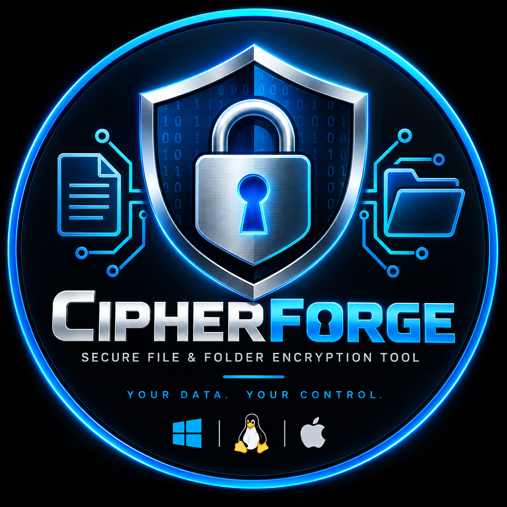

  

<h1 align="center">🔐 CipherForge</h1>

  <strong>Secure File & Folder Encryption Tool</strong>

  A modern cross-platform Python desktop application for securely
  encrypting and decrypting files and folders.

  
  
  
  
  
  
  

---

<h2>✨ Features</h2>

<ul>
  <li>🔒 AES-256-GCM encryption</li>
  <li>🔒 ChaCha20-Poly1305 encryption</li>
  <li>📄 File encryption and decryption</li>
  <li>📁 Folder encryption and decryption</li>
  <li>🔑 Password-based encryption</li>
  <li>🗝️ Recovery key generation</li>
  <li>💾 Recovery key file storage</li>
  <li>🛡️ Authenticated encryption</li>
  <li>⚙️ Persistent application settings</li>
  <li>🖥️ PySide6 desktop GUI</li>
  <li>⚡ Background encryption/decryption workers</li>
  <li>🔐 Argon2id password-based key derivation</li>
  <li>🔑 HKDF-SHA256 recovery key derivation</li>
  <li>💻 Windows support</li>
  <li>🐧 Linux support</li>
  <li>📦 Portable project usage</li>
</ul>

---

<h2>💻 Supported Platforms</h2>

<table>
<tr>
<th>Platform</th>
<th>Status</th>
</tr>

<tr>
<td>🪟 Windows</td>
<td>✅ Supported</td>
</tr>

<tr>
<td>🐧 Linux</td>
<td>✅ Supported</td>
</tr>

<tr>
<td>🍎 macOS</td>
<td>✅ Supported</td>
</tr>
</table>

CipherForge is designed as a cross-platform Python/PySide6 application.
Windows and Linux are the primary supported platforms.

---

<h2>🔐 Supported Encryption Algorithms</h2>

<table>
<tr>
<th>Algorithm</th>
<th>Type</th>
<th>Status</th>
</tr>

<tr>
<td>AES-256-GCM</td>
<td>Authenticated Encryption</td>
<td>✅ Supported</td>
</tr>

<tr>
<td>ChaCha20-Poly1305</td>
<td>Authenticated Encryption</td>
<td>✅ Supported</td>
</tr>
</table>

---

<h2>🛡️ Security</h2>

CipherForge uses modern authenticated encryption and protected key-management
mechanisms to secure encrypted data.

<ul>
  <li>256-bit encryption keys</li>
  <li>AES-256-GCM</li>
  <li>ChaCha20-Poly1305</li>
  <li>Argon2id password derivation</li>
  <li>HKDF-SHA256 recovery-key derivation</li>
  <li>Random encryption secrets</li>
  <li>Authenticated encrypted chunks</li>
  <li>Integrity verification during decryption</li>
  <li>Atomic output handling</li>
</ul>

---

<h2>🚀 Installation</h2>

<h3>📋 Requirements</h3>

<ul>
  <li>Python 3.10 or newer</li>
  <li>pip</li>
  <li>Git — optional</li>
</ul>

<h3>📥 Clone Repository</h3>

git clone https://github.com/FATEHALI-ABBASALI/CipherForge-Encryption-Tool.git
cd CipherForge-Encryption-Tool
<h2>🚀 Installation & Run</h2>

<h3>1. Clone the Repository</h3>

<pre><code>git clone https://github.com/FATEHALI-ABBASALI/CipherForge-Encryption-Tool.git
cd CipherForge-Encryption-Tool</code></pre>

<h3>2. Create Python Environment</h3>

<strong>Windows:</strong>

<pre><code>python -m venv .venv</code></pre>

<strong>Linux:</strong>

<pre><code>python3 -m venv .venv</code></pre>

<h3>3. Activate Environment</h3>

<strong>Windows PowerShell:</strong>

<pre><code>.\.venv\Scripts\Activate.ps1</code></pre>

<strong>Linux:</strong>

<pre><code>source .venv/bin/activate</code></pre>

<h3>4. Install Requirements</h3>

<pre><code>pip install -r requirements.txt</code></pre>

<h3>5. Run CipherForge</h3>

<strong>Windows:</strong>

<pre><code>python run.py</code></pre>

<strong>Linux:</strong>

<pre><code>python3 run.py</code></pre>
